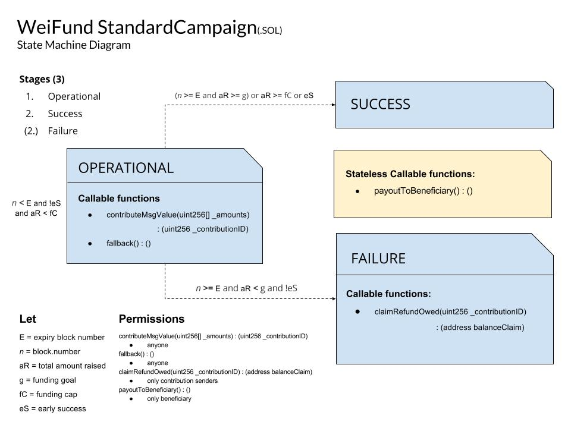
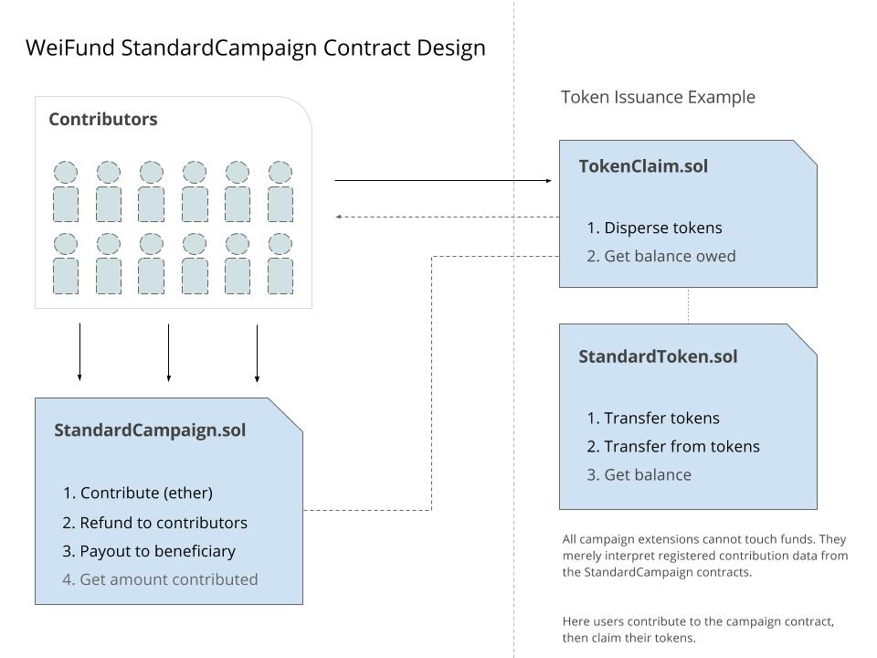
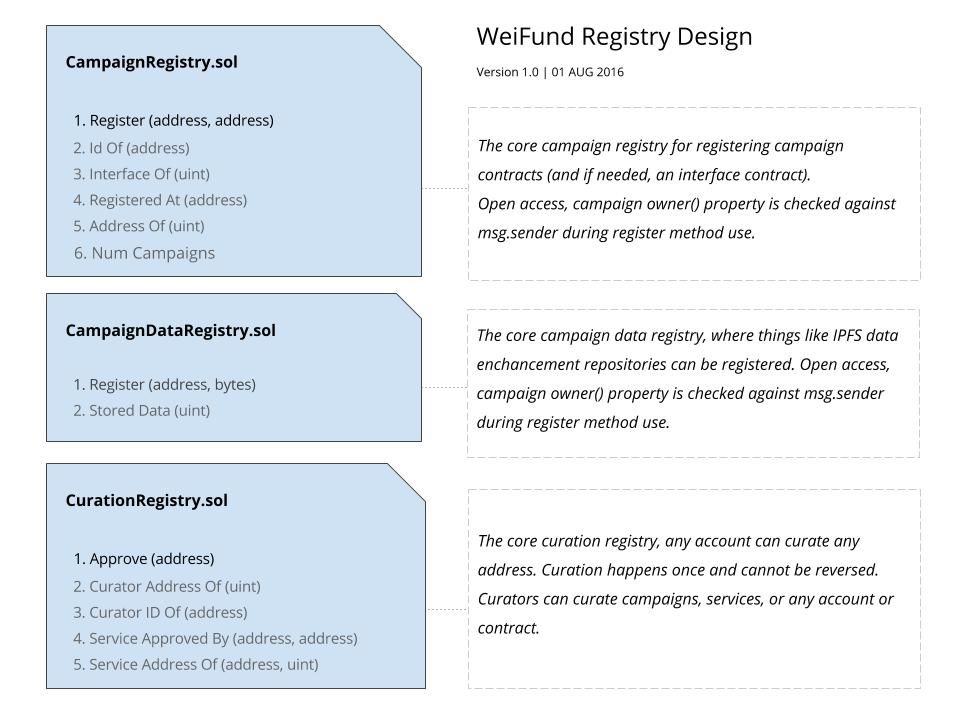

# Developer Guide

All information regarding contributing to and progressing weifund-contracts module can be found in this document.

## Install from Source

You must have an `account.json` file directly outside this repo, with your account `{"address": "0x00..", "privateKey": "0x000..."}` specified.

```
git clone http://github.com/weifund/weifund-contracts
npm install
```

## Build

This will create a webpackified es2015 build of the JS module to `dist/weifund-contracts.js`;

```
npm run build
```

## Build Contracts

To just build the contracts, run:

```
npm run build:contracts
```

## Test

```
npm test
```

## Contract Tests

Test specific contracts individually (note this may take a long time (15+ minutes))

```
npm run test:utils
npm run test:campaigns
npm run test:factories
npm run test:claims
npm run test:registries
npm run test:verifiers
npm run test:tokens
npm run test:wallets
npm run test:enhancers
```

Test all contracts (note this may take a long time (15+ minutes))

```
npm run test:contracts
```

## Folder Structure

All module source code is found in the `src` directory. All module helper scripts can be found in the `scripts` folder. These will not need to be touched, and are purely configuration for this repository.

```
./weifund-contracts
  ./.github
  ./docs
  ./assets
  ./coveralls
  ./dist
  ./internals
    ./webpack
    ./scripts
    ./deployment
  ./src
    ./contracts
      ./campaigns
      ./claims
      ./enhancers
      ./verifiers
      ./factories
      ./registries
      ./tokens
      ./utils
      ./wallets
    ./lib
    ./tests
```

## Contract Security Priority

This is the priority list for security. Priority one contracts move funds and are most vulnerable to attack and failure causing the loss of funds. Priority level 2 can affect fund flow, but do not and should not be moving funds directly. They can affect the dispersal of assets to contributors and founders.

### Priority Level 1:
 - StandardCampaign.sol **handles funds**
 - claims/BalanceClaim.sol **handles funds**
 - wallets/MultiSigWallet.sol **handles funds**

### Priority Level 2:
 - tokens/IssuedToken.sol
 - enhancers/Model1Enhancer.sol
 - factories/StandardCampaignFactory.sol
 - factories/MultiSigWalletFactory.sol
 - factories/IssuedTokenFactory.sol
 - factories/Model1EnhancerFactory.sol
 - verifiers/OwnedVerifier.sol

### Priority Level 3:
 - registries/PrivateServiceRegistry.sol
 - registries/CurationRegistry.sol
 - registries/CampaignRegistry.sol
 - registries/CampaignCurationRegistry.sol

## Webpack

The `weifund-contracts` module is fully browserifiable. Simple run `npm run build` to webpack build the module, then check `dist/weifund-contracts.js` for the final build.

## Contributing

Please help better the ecosystem by submitting issues and pull requests to default. We need all the help we can get to build the absolute best linting standards and utilities. We follow the AirBNB linting standard. Please read more about contributing to `weifund-contracts` in the `CONTRIBUTING.md`.

## Campaign Interface

All WeiFund registered campaigns must follow the `Campaign.sol` interface. If a crowdsale does not follow this interface, you can subsequently register an interface contract, which will interpret the campaign contract data into the `Campaign.sol` interface structure.

The Campaign.sol interface is as follows:

```
pragma solidity ^0.4.4;


/// @title Campaign contract interface for WeiFund standard campaigns
/// @author Nick Dodson <nick.dodson@consensys.net>
contract Campaign {
  /// @notice the creater and operator of the campaign
  /// @return the Ethereum standard account address of the owner specified
  function owner() public constant returns(address) {}

  /// @notice the campaign interface version
  /// @return the version metadata
  function version() public constant returns(string) {}

  /// @notice the campaign name
  /// @return contractual metadata which specifies the campaign name as a string
  function name() public constant returns(string) {}

  /// @notice use to determine the contribution method abi/structure
  /// @return will return a string that is the exact contributeMethodABI
  function contributeMethodABI() public constant returns(string) {}

  /// @notice use to determine the contribution method abi
  /// @return will return a string that is the exact contributeMethodABI
  function refundMethodABI() public constant returns(string) {}

  /// @notice use to determine the contribution method abi
  /// @return will return a string that is the exact contributeMethodABI
  function payoutMethodABI() public constant returns(string) {}

  /// @notice use to determine the beneficiary destination for the campaign
  /// @return the beneficiary address that will receive the campaign payout
  function beneficiary() public constant returns(address) {}

  /// @notice the block number at which the campaign fails or succeeds
  /// @return the uint block number at which time the campaign expires
  function expiry() public constant returns(uint256 blockNumber) {}

  /// @notice the goal the campaign must reach in order for it to succeed
  /// @return the campaign funding goal specified in wei as a uint256
  function fundingGoal() public constant returns(uint256 amount) {}

  /// @notice the maximum funding amount for this campaign
  /// @return the campaign funding cap specified in wei as a uint256
  function fundingCap() public constant returns(uint256 amount) {}

  /// @notice the goal the campaign must reach in order for it to succeed
  /// @return the campaign funding goal specified in wei as a uint256
  function amountRaised() public constant returns(uint256 amount) {}

  /// @notice the block number that the campaign was created
  /// @return the campaign start block specified as a block number, uint256
  function created() public constant returns(uint256 timestamp) {}

  /// @notice the current stage the campaign is in
  /// @return the campaign stage the campaign is in with uint256
  function stage() public constant returns(uint256);

  /// @notice if it supports it, return the contribution by ID
  /// @return returns the contribution tx sender, value and time sent
  function contributions(uint256 _contributionID) public constant returns(address _sender, uint256 _value, uint256 _time) {}

  // Campaign events
  event ContributionMade (address _contributor);
  event RefundPayoutClaimed(address _payoutDestination, uint256 _payoutAmount);
  event BeneficiaryPayoutClaimed (address _payoutDestination);
}
```

See the `Campaign.sol` contract here: [Campaign.sol](../../../blob/master/src/contracts/campaigns/Campaign.sol)

## StandardCampaign State Machine



The WeiFund StandardCampaign has three stages:

`CrowdfundOperational`
`CrowdfundFailure`
`CrowdfundSuccess`

These stages are constrained by the `stage` method in the `StandardCampaign.sol` contract:

```
function stage() public constant returns (uint256) {
  // if current time is less than the expiry, the crowdfund is operational
  if (block.number < expiry
    && earlySuccess == false
    && amountRaised < fundingCap) {
    return uint256(Stages.CrowdfundOperational);

  // if n >= e and aR < fG then the crowdfund is a failure
  } else if(block.number >= expiry
    && earlySuccess == false
    && amountRaised < fundingGoal) {
    return uint256(Stages.CrowdfundFailure);

  // if n >= e and aR >= fG or aR >= fC or early success triggered
  // then the crowdfund is a success (enhancers can trigger early success)
  // early success is generally used for TokenCap enforcement
  } else if((block.number >= expiry && amountRaised >= fundingGoal)
    || earlySuccess == true
    || amountRaised >= fundingCap) {
    return uint256(Stages.CrowdfundSuccess);
  }
}
```

## Early Success Concept

The `StandardCampaign` contact is designed to be fairly accomidating to token crowdsales. Many token crowdsales use a funding cap (in `ETH`) and a token cap (in token amounts). Usually the funding cap cannot be exceeded, nor the token cap. The `earlySuccess` flag can be triggered by a third-party token issuing enhancer, thus triggering a success state in the campaign state machine. This allows the enhancer to enforce things like token caps, by triggering the `earlySuccess` flag when the token cap is reached.

The `earlySuccess` can also be used to close out campaigns that have not been setup properly. The beneficiary can trigger the earlySuccess flag and cause a success state to prevent further contributions from entering the campaign contract.

## StandardCampaign and Generic Contract Philosophy



The WeiFund crowdfunding contract design philosophy asserts that funds for crowdsales should be moved through secure contracts that do not change often, and are constantly overviewed and tested.

All third-party modules that operate activities such as token issuance or membership issuance, should be constructued in outside claim contracts that cannot alter or modify the campaign contract design.

This way, all funds from the time they leave the contributor account to when they either enter the beneficiary or are returned to the contributer are handled in contracts that are secure and generic.

The StandardCampaign contract can be found here: [StandardCampaign.sol](../../../blob/master/src/contracts/campaigns/StandardCampaign.sol)

## BalanceClaim Mechanism

For further re-entrancy prevention, the WeiFund StandardCampaign contract will not send ether directly to a third-party account. All refunds to third-party contributors are sent to a newly created BalanceClaim contract, where the refund claimant can receive the funds by calling `claimBalance()`.

```
pragma solidity ^0.4.3;


contract BalanceClaimInterface {
  /// @notice use `claimBalance` to selfdestruct this contract and claim all balance to the owner address
  function claimBalance();
}
```

The BalanceClaim contract can be found here: [BalanceClaim.sol](../../../blob/master/src/contracts/claims/BalanceClaim.sol)

## Payout To Beneficiary

This method has many uses: (1) paying out under a success state, (2) paying out the campaign under a failed or operational state, if something has gone catastrophically wrong, (3) shutting down campaigns that were not setup properly.

For now, the `payoutToBenificary` method is stateless, and can be triggered by the benificary at anytime. This is to both protect campaign funds and allow normal beneficiary payout.

While we must trust that the benificary pays out under a state success, if all goes well. The mechanism is designed to allow for the benificary to payout early or under failure, just incase there is some problem or invarience we could not forsee in auditing or testing.

## Example Campaign Deployment Schedules

This is an example deployment schedule using a campaign that uses the IssuedToken, Model1Enhancer, StandardCampaign and MultiSigWallet contracts.

Example Deployment Schedule

1. `MultiSigWallet`
2. `IssuedToken`
3. `Model1Enhancer`
  - IssuedToken setIssuer -> Model1Enhancer instance
4. `StandardCampaign`
  - Model1Enhancer setCampaign -> StandardCampaign instance

## Registry Contracts



WeiFund uses several registries which are open simple modules. The registry contracts are:

  1. [CampaignDataRegistry.sol](../../../blob/master/src/contracts/registries/CampaignDataRegistry.sol) - Storing IPFS Hashes against registered campaigns
  2. [CurationRegistry.sol](../../../blob/master/src/contracts/registries/CurationRegistry.sol) - Allows anyone to curate any campaign list
  3. [CampaignRegistry.sol](../../../blob/master/src/contracts/registries/CampaignRegistry.sol) - Registering campaigns in the main registry

## Contract Deployment Scripts

All essential WeiFund factory and registry contracts can be deployed easily deployment scripts, found in the [deployment](../../../blob/master/internals/deployment/) dir.

You must have an `account.json` file directly outside this repo, with your account `{"address": "0x00..", "privateKey": "0x000..."}` specified.

### Testnet:

  ```
  npm run deploy:testnet
  ```

### Mainnet:

  ```
  npm run deploy:mainnet
  ```

  This will generate and/or modify an [`environments.json`](../../../blob/master/src/lib/environments.json) file.
